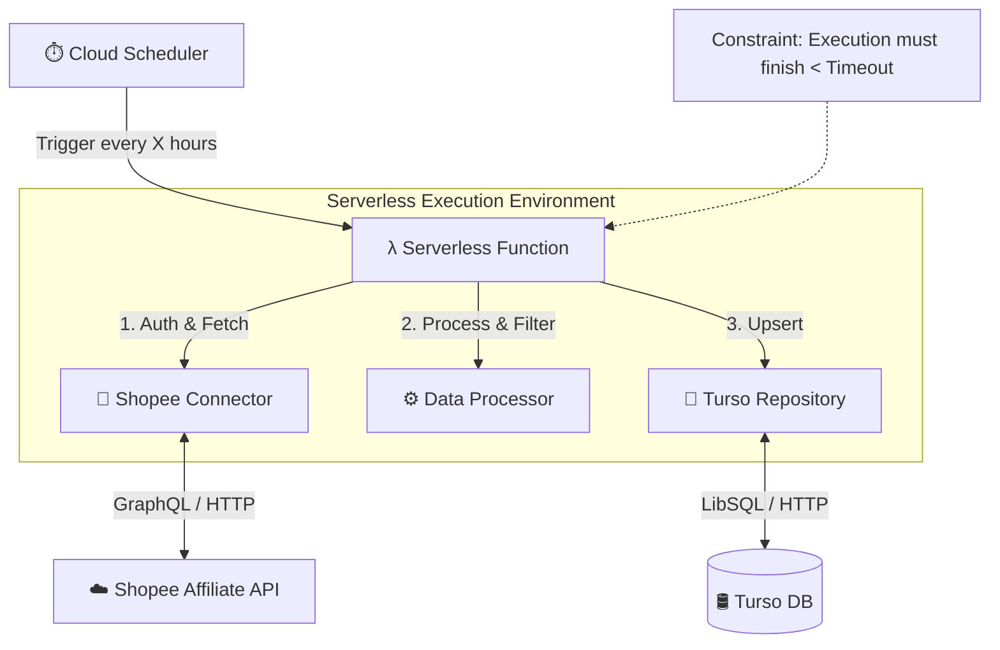
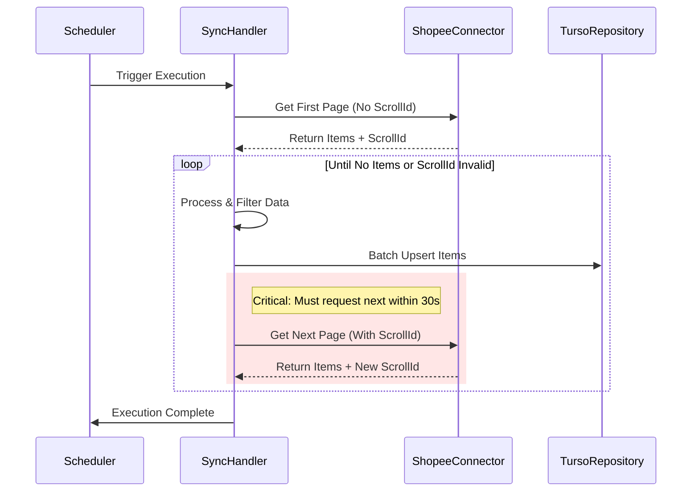

# Architecture Document: Shopee Offer List Synchronization Service

| Project Name | Shopee Offer List Synchronization Service |
| :--- | :--- |
| **Version** | 1.0 |
| **Status** | Approved |
| **Last Updated** | 2025-11-15 |
| **Author** | Winston (Architect) |

## 1. Introduction

เอกสารฉบับนี้ระบุสถาปัตยกรรมสำหรับบริการซิงโครไนซ์ข้อมูล Shopee Affiliate โดยมุ่งเน้นที่การใช้สถาปัตยกรรม **Event-Driven Serverless** เพื่อให้สอดคล้องกับข้อจำกัดด้านงบประมาณ (0 บาท) และความต้องการในการอัปเดตข้อมูลอย่างต่อเนื่อง

ระบบนี้จะทำหน้าที่เป็น Backend Service อิสระที่ทำงานตามตารางเวลา (Scheduled Task) เพื่อดึงข้อมูลจาก Shopee API และจัดเก็บลงในฐานข้อมูล Turso

## 2. High Level Architecture

### 2.1 Technical Summary

ระบบใช้สถาปัตยกรรมแบบ **Function-as-a-Service (FaaS)** ที่ถูกกระตุ้นด้วยเวลา (Time-based Trigger) การทำงานจะเริ่มจาก **Scheduler** ส่ง Event ไปยัง **Cloud Function** ซึ่งจะทำหน้าที่เป็น Orchestrator ในการเชื่อมต่อกับ **Shopee API** (External) เพื่อดึงข้อมูล จัดการ Pagination และบันทึกผลลัพธ์ที่ผ่านการคัดกรองแล้วลงใน **Turso Database** (Serverless SQLite)

### 2.2 High Level Diagram



### 2.3 Architectural Patterns

- **Event-Driven Architecture**: ระบบทำงานเมื่อถูกกระตุ้น (Trigger) เท่านั้น ไม่มีการรัน Server ค้างไว้ (Non-idling) เพื่อประหยัดค่าใช้จ่าย
- **Repository Pattern**: แยก Logic การติดต่อฐานข้อมูลออกจาก Business Logic เพื่อให้ง่ายต่อการทดสอบและเปลี่ยนผ่าน
- **Pipeline Pattern**: การประมวลผลข้อมูลเป็นลำดับขั้น (Fetch -> Filter -> Save)

## 3. Tech Stack

| Category | Technology | Version | Purpose | Rationale |
| :--- | :--- | :--- | :--- | :--- |
| Runtime | Node.js (TypeScript) | 20.x (LTS) | Execution Environment | Cold start เร็ว, Library Support ดีเยี่ยมสำหรับ GraphQL และ Serverless |
| Database | Turso (LibSQL) | Latest | Persistent Storage | Free Tier ใจป้ำ, เหมาะกับ Serverless (HTTP Protocol), รองรับ Edge |
| Compute | AWS Lambda / Google Cloud Functions | - | Serverless Compute | มี Free Tier ที่รองรับการทำงานแบบ Scheduled โดยไม่มีค่าใช้จ่ายรายเดือน |
| Scheduler | AWS EventBridge / Cloud Scheduler | - | Trigger | เครื่องมือมาตรฐานสำหรับตั้งเวลา Cron Job บน Cloud |
| API Client | graphql-request หรือ axios | Latest | HTTP Client | น้ำหนักเบา เหมาะสำหรับการยิง GraphQL พื้นฐาน |
| Validation | zod | Latest | Schema Validation | ตรวจสอบโครงสร้างข้อมูลจาก API ก่อนนำไปใช้ |

## 4. Data Models

### 4.1 Logical Data Model: Offer

โมเดลหลักสำหรับเก็บข้อมูลสินค้า โดยคัดเลือกเฉพาะ Field ที่จำเป็นตาม PRD

| Attribute | Type | Description | Mapped Field (Shopee) |
| :--- | :--- | :--- | :--- |
| offer_id | String (PK) | รหัสสินค้า (Unique ID) | offerId |
| name | String | ชื่อสินค้า | offerName |
| price | Float | ราคาสินค้า | price |
| commission_rate | Float | อัตราคอมมิชชัน (ทศนิยม) | commissionRate |
| commission | Float | ค่าคอมมิชชันโดยประมาณ | commission |
| link | String | ลิงก์สินค้า (Affiliate Link) | link |
| image_url | String | URL รูปภาพหลัก | imageUrl |
| category_name | String | หมวดหมู่สินค้า | categoryName |
| updated_at | Integer | Timestamp ที่อัปเดตข้อมูลล่าสุด | - |

### 4.2 Database Schema (SQLite/LibSQL)

```sql
CREATE TABLE IF NOT EXISTS offers (
    offer_id TEXT PRIMARY KEY,
    name TEXT NOT NULL,
    price REAL,
    commission_rate REAL,
    commission REAL,
    link TEXT,
    image_url TEXT,
    category_name TEXT,
    updated_at INTEGER NOT NULL
);

CREATE INDEX IF NOT EXISTS idx_offers_updated_at ON offers(updated_at);
```

## 5. Components Design

### 5.1 ShopeeConnector

รับผิดชอบการสื่อสารกับ Shopee API ทั้งหมด

**Responsibilities:**
- สร้าง Signature (HMAC-SHA256)
- สร้าง GraphQL Query payload
- ส่ง HTTP Request
- **Critical**: จัดการ Pagination logic และ scrollId refresh ภายใน 30 วินาที

### 5.2 DataProcessor

รับผิดชอบการแปลงและคัดกรองข้อมูล

**Responsibilities:**
- Map fields จาก JSON Response มาเป็น Offer model
- Filter ข้อมูลที่ไม่ต้องการทิ้ง (White-listing)
- Validate data types (เช่น แปลง String price เป็น Number)

### 5.3 TursoRepository

รับผิดชอบการติดต่อฐานข้อมูล

**Responsibilities:**
- Initialize connection (@libsql/client)
- Execute Batch Upsert (เพื่อประสิทธิภาพสูงสุด ลด Round-trip)
- Handle DB errors

### 5.4 SyncHandler (Entry Point)

ฟังก์ชันหลักที่จะถูกเรียกโดย Scheduler

**Responsibilities:**
- Orchestrate flow: Connector -> Processor -> Repository
- จัดการ Loop จนกว่าจะหมดหน้า (Pagination exhaustion)
- จับเวลาการทำงานไม่ให้เกิน Timeout (Graceful shutdown)
- Error Logging

## 6. Core Workflows

### 6.1 Sync Process Sequence



## 7. Security & Constraints

### 7.1 Security

- **Secrets Management**: AppId, Secret, และ Turso Token ต้องเก็บใน Environment Variables ของ Cloud Function เท่านั้น ห้าม Hardcode
- **Signature**: ต้องคำนวณใหม่ทุก Request ห้าม Re-use เพื่อความปลอดภัยตามมาตรฐาน Shopee

### 7.2 Technical Constraints Handling

- **Execution Timeout**: หากปริมาณสินค้ามากจนดึงไม่ทัน Timeout (เช่น 15 นาที) ระบบต้องออกแบบให้สามารถ "จำ" สถานะ (ถ้าทำได้) หรือยอมรับการเริ่มใหม่ในรอบหน้า (Stateless preferred for simple architecture)
- **Memory**: การประมวลผลควรทำเป็น Chunk (ทีละหน้า) ไม่ควรโหลดข้อมูลทั้งหมดลง Memory แล้วค่อยบันทึกทีเดียว

## 8. Project Structure (Monorepo/Unified)

```
shopee-offer-sync/
├── src/
│   ├── lib/
│   │   ├── db.ts           # Turso Client Instance
│   │   ├── shopee.ts       # Signature & API Logic
│   │   └── utils.ts        # Helper functions
│   ├── services/
│   │   └── syncService.ts  # Core Business Logic
│   ├── index.ts            # Entry Point (Handler)
│   └── types.ts            # TypeScript Interfaces
├── db/
│   └── migrations/         # SQL Migration Scripts
├── scripts/                # Utility scripts (deploy, test)
├── .env.example
├── package.json
├── tsconfig.json
└── README.md
```
